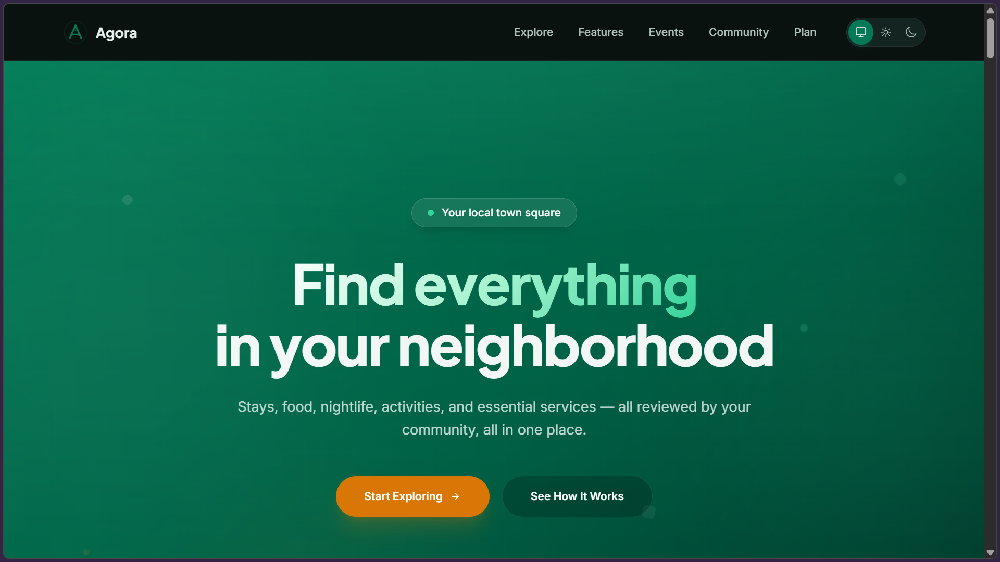

# Agora — Your City's Town Square

> *Agora (Ancient Greek: ἀγορά) — the central public space and heart of community life.*

**Agora** is a hyper-local discovery and community platform that unifies food, nightlife, sports,
arts, community events, stays, and essential services into one fast, beautiful web experience.
Type a craving, check a map, and know what's happening *now* — every venue ranked, reviewed,
and one click from your plans.

[](docs/hero.png)

<!-- TODO: add live URL once deployed — replace the hero link above with <a href="https://…"> -->

## Why I Built This

I kept hitting the same wall in every city I've lived in: the answer to *"what's good near me?"*
lives scattered across Google Maps, Yelp, Instagram, event pages, and word of mouth — and none of
it tells me what's actually happening **today**. So I built Agora as the town square I wished
existed: one place where local discovery stops being a research job.

What started as a side project to lock down my React + TypeScript fundamentals grew into a full
product shell — real search across names, categories, and tags, an interactive map, a live
"What's Happening Today" feed with a *Live now* pulse, and a favorites + planner dashboard that
survives reloads via local storage. It's the project where I learned to think in components,
design systems, and polished, production-feeling frontends — and it's built to keep growing
toward real data.

## What's Inside

**80 places across 7 categories**, plus a weekly event feed — all searchable, filterable,
and mapped:

| Pillar | What it covers |
| --- | --- |
| **Food & Drink** | Cafés, brunch spots, restaurants |
| **Nightlife** | Bars, silent discos, jazz sets |
| **Sports & Fitness** | Five-a-side leagues, run collectives, gyms |
| **Arts & Culture** | Galleries, theaters, museums |
| **Community & Events** | Farmers markets, workshops, chess clubs |
| **Stays & Places** | Hotels and places worth visiting |
| **Essential Services** | Everyday services people need locally |

## Features

- **Live search** across place names, categories, and tags — with a real-time result count.
- **Interactive map** — pins synced to your current results for instant geographic context.
- **"What's Happening Today"** — a day-windowed feed (Today / Tomorrow / This Weekend) with a
  **Live now** indicator for events running this minute.
- **Favorites with persistence** — heart any place and it's stored in `localStorage`, ready on
  the next visit.
- **Planner dashboard** — drop favorites onto Today / Tomorrow / This Weekend and see your
  neighborhood week at a glance.
- **Full detail pages** — reviews, ratings, hours, price, address, and phone for every place.
- **System-adaptive Light/Dark mode** with a one-click toggle.

## Tech Stack

| Layer | Choice |
| --- | --- |
| Language | TypeScript |
| UI library | React 19 (SPA, `react-router-dom` v7) |
| Build tool | Vite 8 |
| Styling | Tailwind CSS v4 (via `@tailwindcss/vite`) |
| Testing | Vitest + React Testing Library + `@testing-library/user-event` |
| Linting | Oxlint |
| Package manager | pnpm |

## Prerequisites

- **Node.js** 20.19+ or 22.12+ (required by Vite 8)
- **pnpm** (see [GETTING_STARTED.md](docs/GETTING_STARTED.md) for install options)

## Quick Start

```bash
# Install dependencies
pnpm install

# Start the dev server (HMR enabled)
pnpm dev
```

Open **http://localhost:5173** — the app boots in dark mode by default. Toggle theme top-right.

## Scripts

| Command | Description |
| --- | --- |
| `pnpm dev` | Start the Vite dev server with hot module replacement |
| `pnpm build` | Type-check (`tsc -b`) then produce a production build |
| `pnpm preview` | Serve the production build locally |
| `pnpm lint` | Run Oxlint over the project |
| `pnpm test` | Run the test suite once (CI-style) |
| `pnpm test:watch` | Run tests in watch mode while developing |

## Project Structure

```
.
├── docs/                   # Project documentation
│   ├── GETTING_STARTED.md  #   prerequisites, install, troubleshooting
│   └── ARCHITECTURE.md     #   stack rationale, layout, conventions
├── public/                 # Static assets served as-is
│   ├── favicon.svg
│   └── icons.svg
├── src/
│   ├── app/                # App shell (Header + Footer layout)
│   ├── components/         # Shared UI (Header, Footer, ThemeToggle)
│   ├── data/               # Domain fixtures (places, events)
│   ├── features/           # Feature slices
│   │   ├── landing/        #   landing page + discovery Showcase
│   │   ├── live/           #   "What's Happening Today" feed
│   │   ├── place/          #   place detail pages
│   │   └── plan/           #   favorites planner dashboard
│   ├── hooks/              # useFavorites, usePlan, useTheme, useScrollReveal
│   ├── test/               # Test setup
│   ├── App.tsx             # Root application component + routes
│   ├── index.css           # Tailwind theme tokens + global styles
│   └── main.tsx            # Application entry point
├── index.html              # Entry HTML
├── vite.config.ts          # Vite + plugins configuration
├── vitest.config.ts        # Vitest configuration
├── tsconfig.json           # TypeScript project configuration
└── package.json
```

## Documentation

- [Getting Started Guide](docs/GETTING_STARTED.md) — prerequisites, install, scripting, troubleshooting
- [Architecture & Conventions](docs/ARCHITECTURE.md) — stack rationale, project layout, data model, conventions

## Try It In a Minute

Search **"coffee"**, **"chess"**, or **"run"** in the Explore bar — results update instantly
with a count. Click a pin on the map to highlight a place, then open any card for the full
detail page. Hit **What's Happening Today** for the day-windowed event feed, **heart** a place
to save it, and open **Plan** to schedule your saved spots across Today, Tomorrow, and the
weekend. Favorites survive a page reload.

## Contributing

```bash
# Clone the repo
git clone <url> && cd agora

# Install dependencies
pnpm install

# Run the test suite
pnpm test

# Lint
pnpm lint

# Submit a pull request
Fork → branch → PR to main.
```

**Conventions:** pnpm only (never npm/yarn) · Vitest + RTL, integration-style tests (no shallow
rendering) · `@testing-library/user-event` (not `fireEvent`) · jest-dom matchers · Oxlint.

## Roadmap

- [x] **Milestone 1** — Core foundation & scaffolding
- [x] **Milestone 2** — Discovery prototype: category dashboard, map, live search, detail pages
- [x] **Milestone 3** — Live events feed, saved favorites, planner dashboard *(quick-filter chips pending)*
- [~] **Milestone 4** — System-adaptive light/dark mode, micro-interactions, production build *(in progress)*

## License

Private — no license granted. All rights reserved.